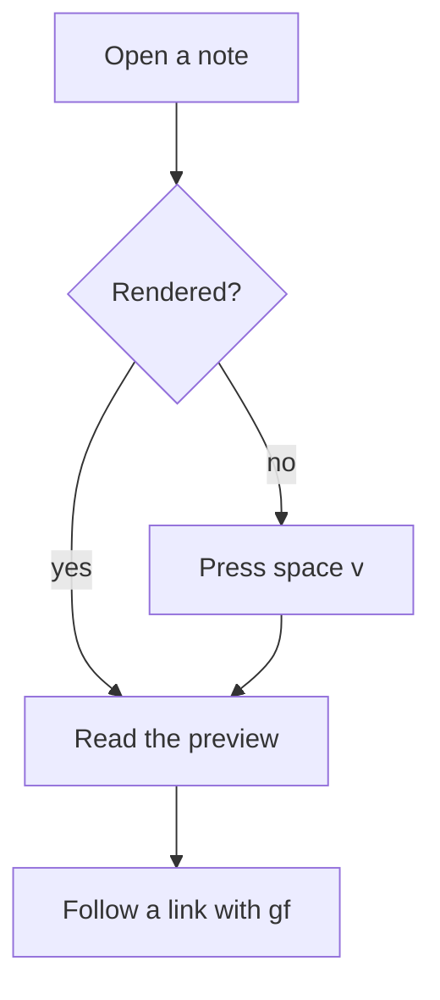
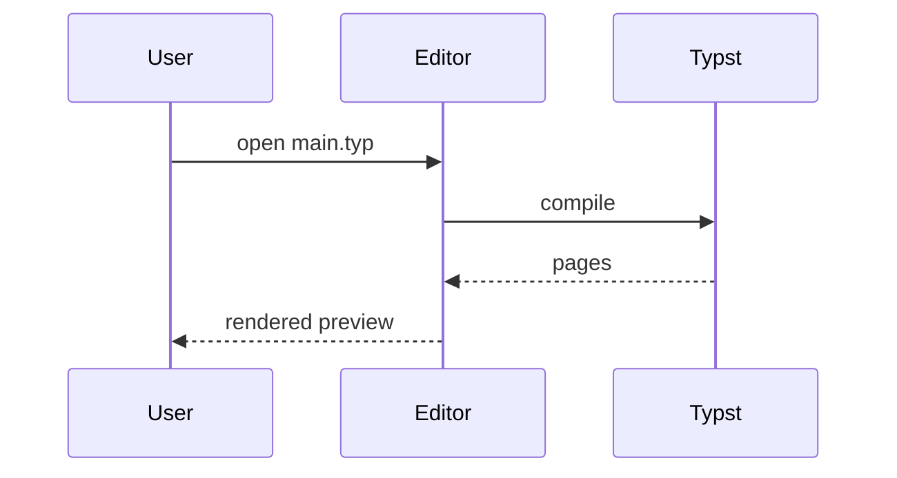

# Diagrams

Mermaid fences render as diagrams in the rendered view.

## Flowchart

```mermaid
flowchart TD
    A[Open a note] --> B{Rendered?}
    B -->|yes| C[Read the preview]
    B -->|no| D[Press space v]
    D --> C
    C --> E[Follow a link with gf]
```

## Sequence

```mermaid
sequenceDiagram
    participant User
    participant Editor
    participant Typst
    User->>Editor: open main.typ
    Editor->>Typst: compile
    Typst-->>Editor: pages
    Editor-->>User: rendered preview
```

Back to the [[index]].
